# Projects

## Project Lifespan

```mermaid
graph TD

request --> research
idea --> research

research --> plan --> define --> implement --> check --> document --> research

define --> terminate
document --> archive

subgraph Active
    implement(Implement, Realisieren, Tagesziel)
    check(Check, Kontrolle)
    document(Document, Auswerten)
end

subgraph Concept
    request(Request, Anfrage)
    idea(Idea, Idee, Vision)
    research(Research, Informieren)
    plan(Plan, Planen, Warte auf)
    define(Define, Entscheiden)
end

subgraph Archived
    archive(Archive, Archivieren)
end

terminate(Terminate, Löschen)

```

**Archive:** Physical Digital & Publication
**Terminate:** Delete all Files and removing all associated stuff

## Filestructure

- projects
    - concept
    - active
    - archive
